 🛡️ Full Linux SOC Monitoring Lab Guide
Ubuntu SOC Server Investigating RHEL Victim 

---

### Screenshot 1: Network Configuration

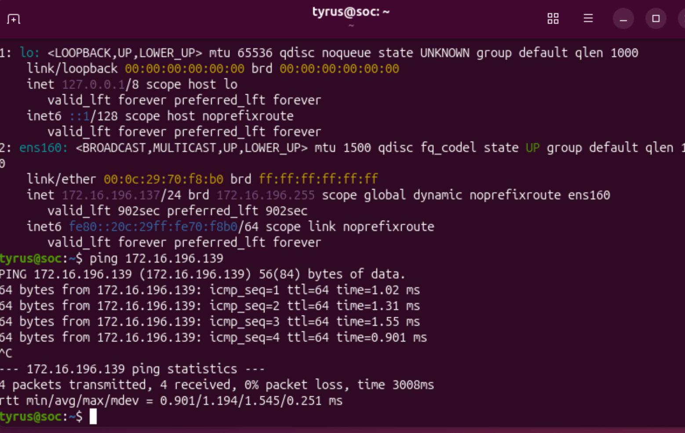 
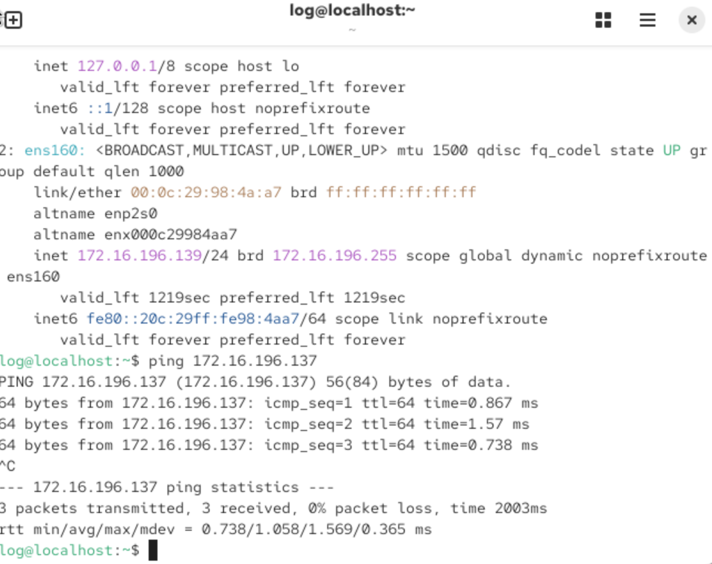 

**What is shown:**  

Established SOC server and monitored endpoint on same network.

---

### Screenshot 2: Prepare RHEL Victim

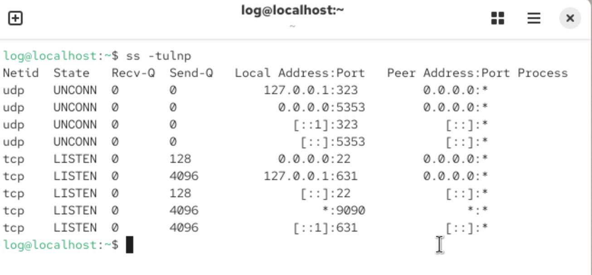

**What is shown:**  

SSH running on victim & Enabled remote access service to simulate attack surface.

---

### Screenshot 3: Create Target User

**What is shown:**  

Created standard user to simulate credential targeting.

---

### Screenshot 4: SOC Server Setup (Ubuntu)

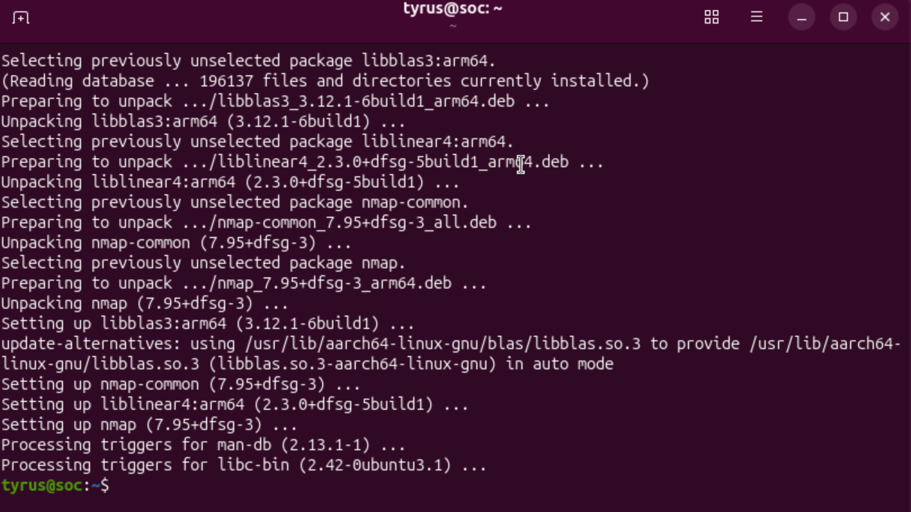

**What is shown:** 

Installed monitoring tools & Configured SOC server with network and log analysis utilities.

---

### Screenshot 5: ATTACK SIMULATION

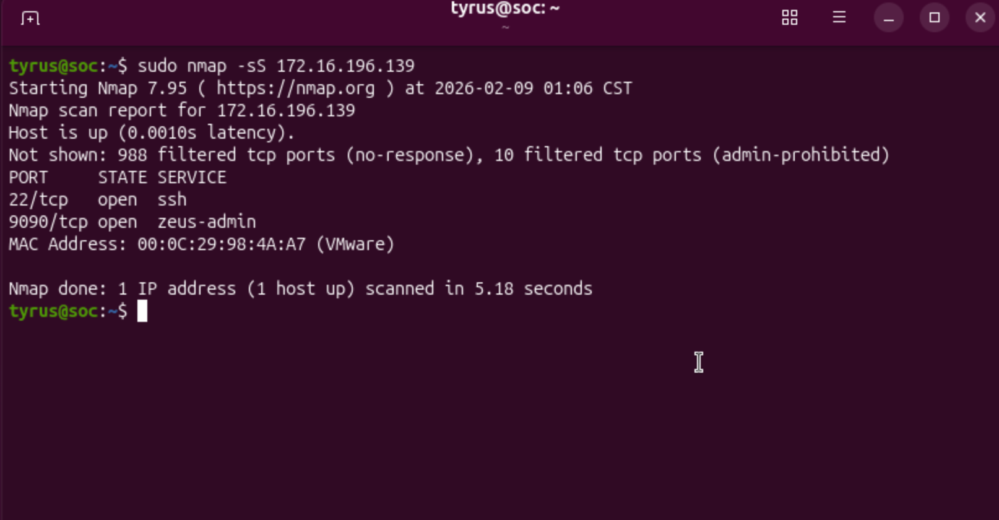

**What is shown:**  

Simulated external reconnaissance identifying exposed services.

---

### Screenshot 6: SOC Investigation

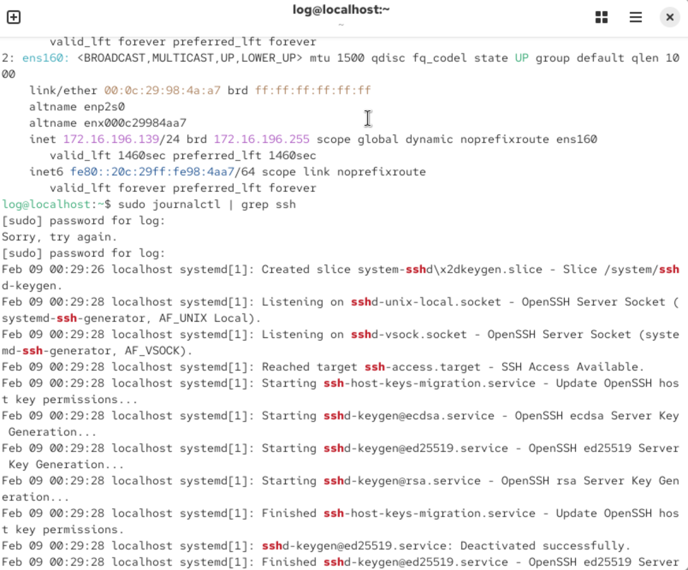

**What is shown:**  

Connection attempts in logs. Detected reconnaissance activity through abnormal connection logs.

---

### Screenshot 7: Attack 2 — SSH Brute Force

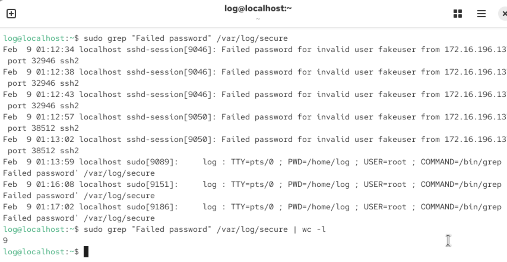

**What is shown:**  

Failed login attempts. Identified brute-force activity through repeated authentication failures.

---

### Screenshot 8: Successful Compromise

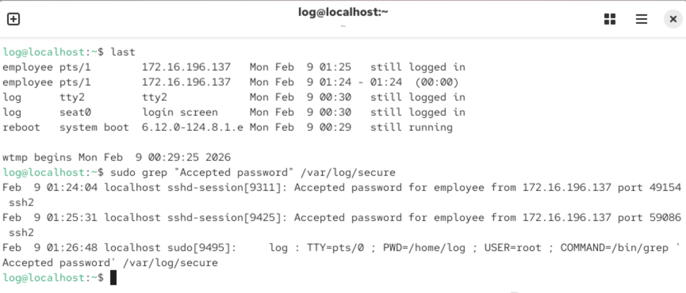

**What is shown:**  

Successful login event, Confirmed unauthorized access to user account.

### Screenshot 9: Persistence Creation

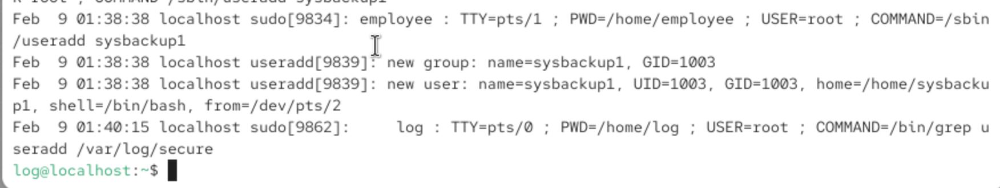

**What is shown:**  

New unauthorized account, Detected attacker persistence through unauthorized account creation

### Screenshot 10: Backdoor Listener

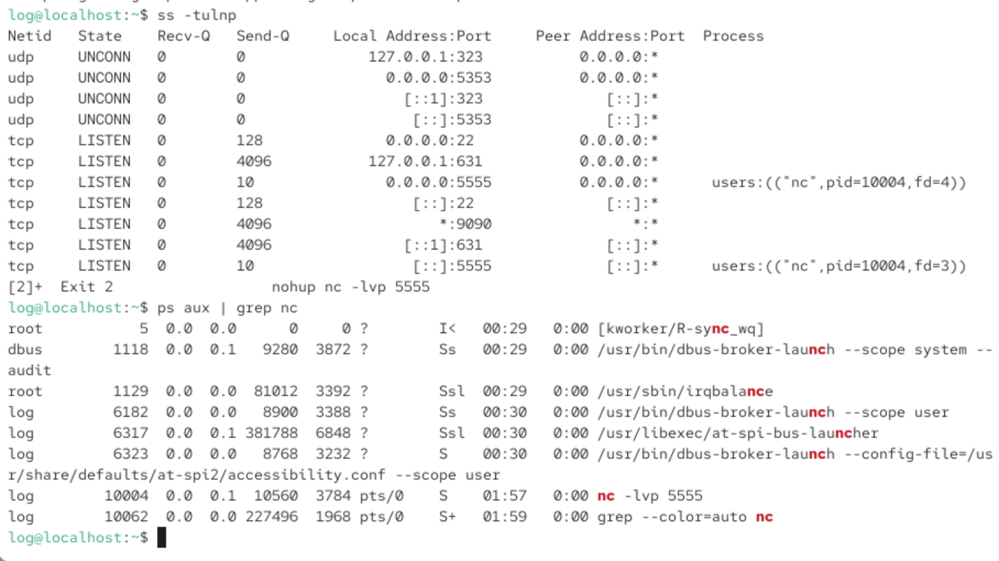

**What is shown:**  

Suspicious port listener, Identified unauthorized network service indicating possible backdoor.

### Screenshot 11: SOC INCIDENT RESPONSE

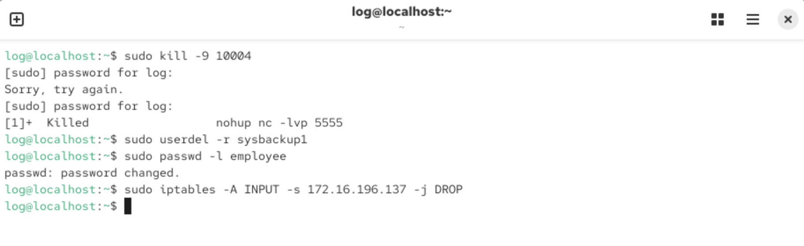

**What is shown:**  

Containment actions applied, Performed containment and eradication procedures

#
